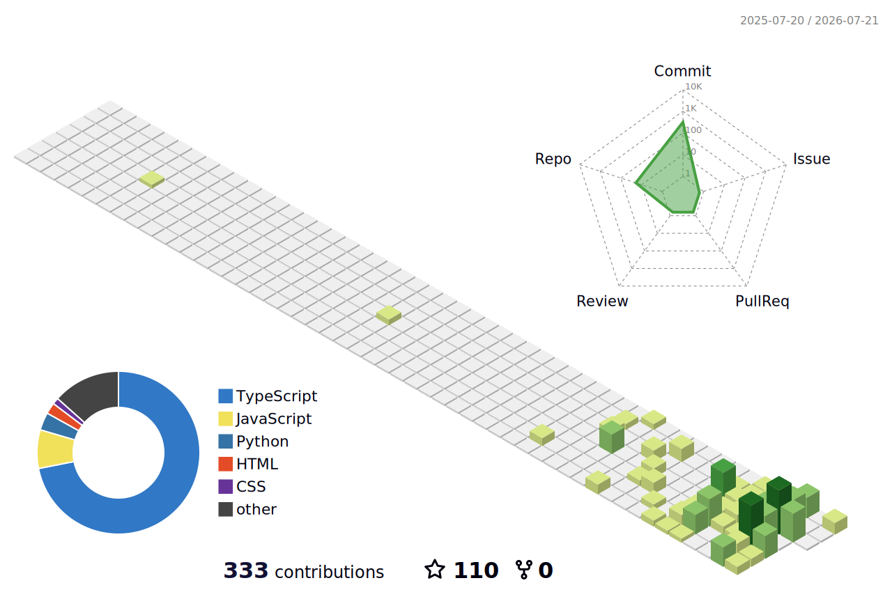

    
  
  
<i>Frontend Developer </i>

  

   
   

  <h3>🛠 Технологический стек</h3>

  <table align="center">
    <tr>
      <td align="center"><b>Frontend</b></td>
      <td>
        
        
        
        
        
        
        
      </td>
    </tr>
    <tr>
      <td align="center"><b>Backend</b></td>
      <td>
        
        
        
        
        
        
      </td>
    </tr>
    <tr>
      <td align="center"><b>Инструменты</b></td>
      <td>
        
        
        
        
      </td>
    </tr>
  </table>

   

  <picture>
    <source media="(prefers-color-scheme: dark)" srcset="https://raw.githubusercontent.com/b4631119-oss/b4631119-oss/output/github-contribution-grid-snake-dark.svg">
    <source media="(prefers-color-scheme: light)" srcset="https://raw.githubusercontent.com/b4631119-oss/b4631119-oss/output/github-contribution-grid-snake.svg">
    
  </picture>

   
   

 
    
  
  
   

