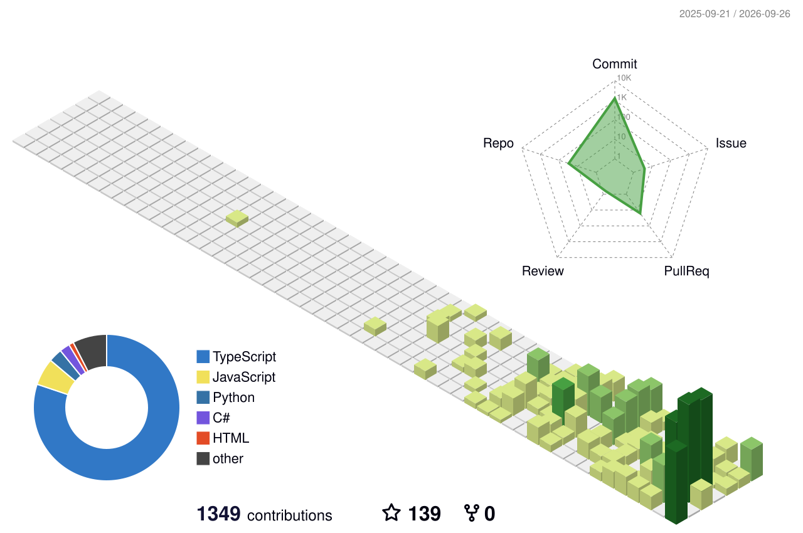

  
  
<i>Frontend Developer</i>

  
  
  
  
  
  
  
  
  
  
  
  
  
  
  
  
  
  
  
  
  
  
  
  
  
  
  
  
  
  
  
  
  
  
  
  
  
  
  
  
  
  
  
  
  
  
  
  
  
  
  
  
  
  
  
  
  
  
  
  
  
  
  
  
  
  
  
  
  
  
  

  
  
  
  

 

  

<!-- Змейка — твой код (исправлено: picture + dark, оба имени snake.svg / github-snake.svg генерятся) -->
<picture data-importer="snake">
  <source media="(prefers-color-scheme: dark)" srcset="https://raw.githubusercontent.com/b4631119-oss/b4631119-oss/snake-output/snake-dark.svg">
  <source media="(prefers-color-scheme: light)" srcset="https://raw.githubusercontent.com/b4631119-oss/b4631119-oss/snake-output/snake.svg">
  
</picture>

 

<!-- Основной Pac-Man — ветка output -->
<picture data-importer="pacman">
  <source media="(prefers-color-scheme: dark)" srcset="https://raw.githubusercontent.com/b4631119-oss/b4631119-oss/output/github-contribution-grid-pacman-dark.svg">
  <source media="(prefers-color-scheme: light)" srcset="https://raw.githubusercontent.com/b4631119-oss/b4631119-oss/output/github-contribution-grid-pacman.svg">
  
</picture>

  

  

<!-- Игры — твой код (4 игры, ветка pacman-output, уже с правильным ?game=) -->
<picture data-importer="pacman">
  <source media="(prefers-color-scheme: dark)" srcset="https://raw.githubusercontent.com/b4631119-oss/b4631119-oss/pacman-output/bomberman-contribution-graph-dark.svg?game=bomberman">
  <source media="(prefers-color-scheme: light)" srcset="https://raw.githubusercontent.com/b4631119-oss/b4631119-oss/pacman-output/bomberman-contribution-graph.svg?game=bomberman">
  
</picture>

<picture data-importer="pacman">
  <source media="(prefers-color-scheme: dark)" srcset="https://raw.githubusercontent.com/b4631119-oss/b4631119-oss/pacman-output/breakout-contribution-graph-dark.svg?game=breakout">
  <source media="(prefers-color-scheme: light)" srcset="https://raw.githubusercontent.com/b4631119-oss/b4631119-oss/pacman-output/breakout-contribution-graph.svg?game=breakout">
  
</picture>

<picture data-importer="pacman">
  <source media="(prefers-color-scheme: dark)" srcset="https://raw.githubusercontent.com/b4631119-oss/b4631119-oss/pacman-output/puzzle-bobble-contribution-graph-dark.svg?game=puzzle-bobble">
  <source media="(prefers-color-scheme: light)" srcset="https://raw.githubusercontent.com/b4631119-oss/b4631119-oss/pacman-output/puzzle-bobble-contribution-graph.svg?game=puzzle-bobble">
  
</picture>

<picture data-importer="pacman">
  <source media="(prefers-color-scheme: dark)" srcset="https://raw.githubusercontent.com/b4631119-oss/b4631119-oss/pacman-output/galaga-contribution-graph-dark.svg?game=galaga">
  <source media="(prefers-color-scheme: light)" srcset="https://raw.githubusercontent.com/b4631119-oss/b4631119-oss/pacman-output/galaga-contribution-graph.svg?game=galaga">
  
</picture>

 

<!-- Счётчик просмотров — твой код -->

  

 

<!-- Статистика — твой код -->

  
  
  
  
  

